<div align="center">


# Applyr AI

### Job hunting is hard. Your tools shouldn't be.

An AI job-hunting agent. It finds live job listings, scores each one against your real profile, researches the company in a cloud browser, and tracks all of it on one dashboard.

[](https://nextjs.org)
[](https://react.dev)
[](https://www.typescriptlang.org)
[](https://tailwindcss.com)
[](https://insforge.dev)
[](https://groq.com)
[](https://www.browserbase.com)

</div>

<br />


<br />

## Contents

- [What Applyr does](#what-applyr-does)
- [Screenshots](#screenshots)
- [Feature map](#feature-map)
- [How it works](#how-it-works)
- [Architecture](#architecture)
- [Authentication](#authentication)
- [The agent pipelines](#the-agent-pipelines)
- [Resume pipeline](#resume-pipeline)
- [Dashboard data](#dashboard-data)
- [Data model](#data-model)
- [UI and design system](#ui-and-design-system)
- [Tech stack](#tech-stack)
- [Project structure](#project-structure)
- [Getting started](#getting-started)
- [Engineering rules](#engineering-rules)
- [Analytics events](#analytics-events)
- [Scope](#scope)
- [Project docs](#project-docs)

<br />

## What Applyr does

Job hunting means the same three chores over and over: **find** postings, **decide** which ones are worth your time, and **research** each company well enough to sound informed. Applyr hands all three to an agent.

| Step | You | Applyr |
|---|---|---|
| 1. Profile | Fill in a profile once, or upload a resume | Extracts your resume into the form as suggestions you accept one by one, and can generate a clean resume PDF from your profile |
| 2. Discover | Enter a job title and location | Searches live Adzuna listings and scores **every** result 0–100 against your profile, with matched skills, missing skills, and a written reason |
| 3. Decide | Filter and sort your scored jobs | Keeps high and low matches alike, so nothing is thrown away at scoring time |
| 4. Research | Click **Research Company** on a job | Opens the company's site in a cloud browser, reads the homepage plus up to three sub-pages, and writes a 9-part dossier tailored to you |
| 5. Apply | Click **Apply** | Sends you to the company's own apply page. Applyr never auto-applies and never uses Easy Apply |

Every step writes to the same Postgres database, and the dashboard reads straight from it, so its numbers always match what you've actually done.

<br />

## Screenshots

<table>
<tr>
<td width="50%">

**Dashboard**: four stat cards, a recent-activity feed, and three charts built from your own jobs data


</td>
<td width="50%">

**Find Jobs**: search controls, then every scored job with filter, sort, and 20-per-page pagination


</td>
</tr>
<tr>
<td width="50%">

**Job details**: the structured posting, the match reasoning, your skills vs. the role, and the company dossier


</td>
<td width="50%">

**Profile**: the data every job is scored against, plus resume upload, extraction, and generation


</td>
</tr>
<tr>
<td width="50%">

**Sign in**: Google or GitHub OAuth through InsForge, next to a product preview panel


</td>
<td width="50%">

**Mobile**: every public page adapts down to phone width

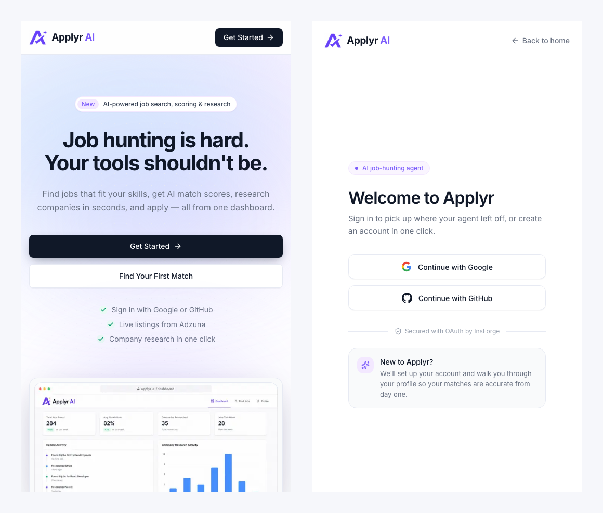

</td>
</tr>
</table>

<details>
<summary><strong>Full homepage</strong> (click to expand)</summary>
<br />
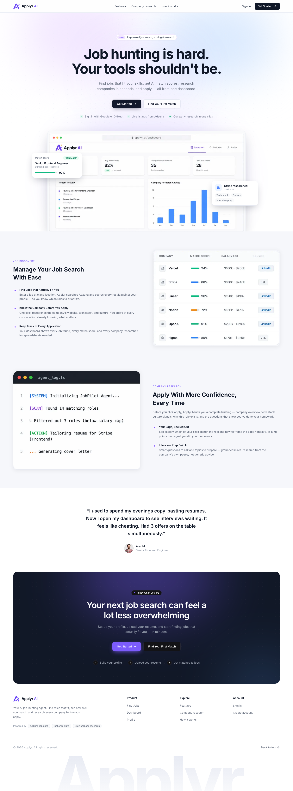
</details>

> The four signed-in screenshots were captured before the September 2026 navbar and logo refresh. Page content is unchanged; only the header looks slightly different now.

<br />

## Feature map

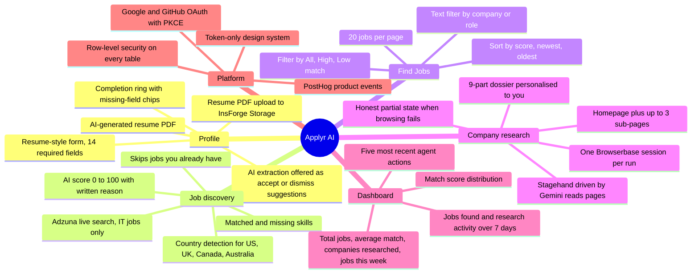

<br />

## How it works

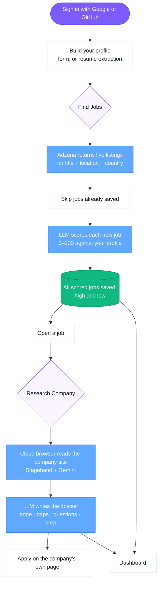

<br />

## Architecture

Applyr is a **single Next.js 16 App Router application**, with no separate backend service. [InsForge](https://insforge.dev) provides auth, Postgres, and file storage as one hosted platform. The two agent pipelines, job discovery and company research, are plain TypeScript modules inside the app, and only API routes call them.

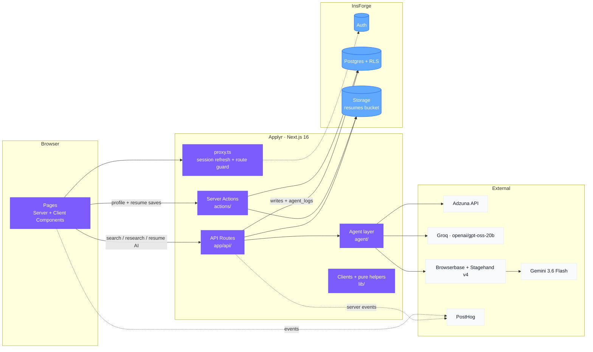

### Layer ownership

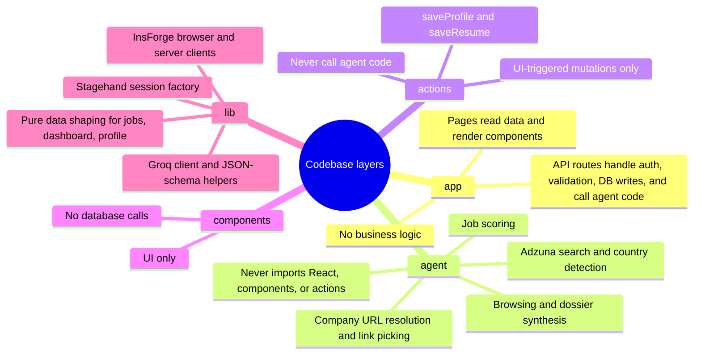

<br />

## Authentication

Sign-in is **server-driven OAuth with PKCE**. The browser never handles tokens. It only follows redirects and carries cookies.

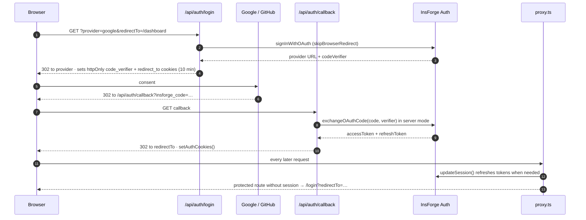

- **Protected routes:** `/dashboard`, `/find-jobs`, `/find-jobs/[id]` and `/profile` are gated in `proxy.ts`. This is Next 16's replacement for `middleware.ts`. A signed-in visitor to `/login` is sent to `/dashboard`.
- **Readable errors only:** failed logins come back to `/login?error=…`. The page shows a plain sentence. The raw code only goes to the server console and PostHog (`oauth_login_failed`).
- **Refresh endpoint:** `/api/auth/refresh` is the SDK's refresh router, and `/api/auth/logout` clears the session.

<br />

## The agent pipelines

### 1. Job discovery: `POST /api/agent/find`

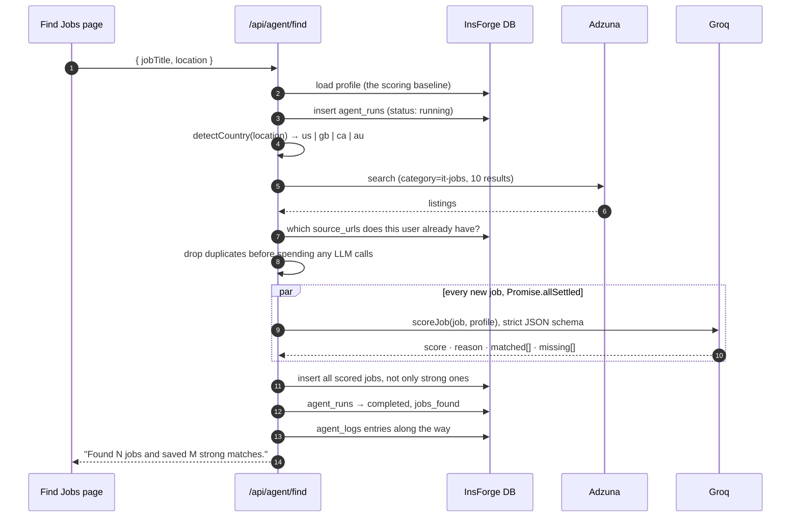

- **Why keep every score:** low matches are still saved. That's how the **Low Match** filter works later, and it lets you decide for yourself.
- **Strong match:** a score of `MATCH_THRESHOLD` = **70** or more (`lib/utils.ts`), the single source of truth.
- **One failure doesn't sink the run:** `Promise.allSettled` means a single failed scoring call doesn't lose the rest of the batch.

### 2. Company research: `POST /api/agent/research`

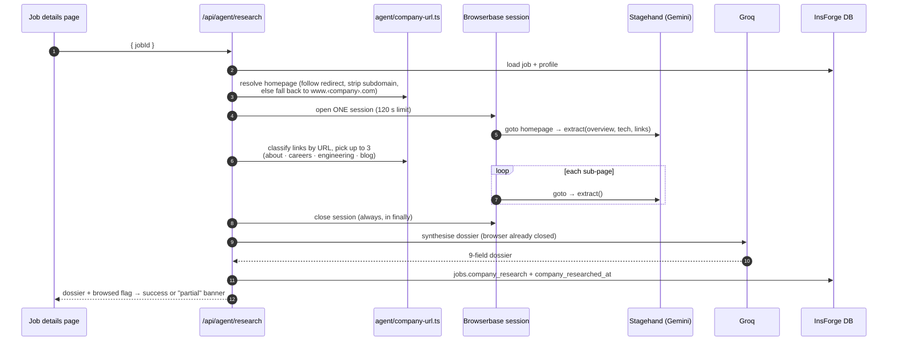

**The dossier** (`jobs.company_research`, strict JSON schema):

| Field | What it contains |
|---|---|
| `companyOverview` | What the company does, from its own pages |
| `techStack` | Technologies mentioned on the site or in the posting |
| `culture` | Values and working-style signals |
| `whyThisRole` | Why the role probably exists right now |
| `yourEdge` | Where *your* skills and past work line up with this company |
| `gapsToAddress` | Your missing skills, reframed as a strategy |
| `smartQuestions` | Questions that show you did your homework |
| `interviewPrep` | Talking points drawn from the research |
| `sources` | The pages that were actually opened, not the model's claims |

**Design choices worth knowing:**

- **Two models, on purpose.** Stagehand sends about 9k tokens per page, which exceeds Groq's free-tier limit of 8k tokens per minute. So Gemini drives the browser, and Groq handles every payload the app controls.
- **The session never stays open during a slow model call.** Browsing and synthesis are separate steps, so a costly cloud browser isn't held open while the LLM thinks.
- **Research always returns a dossier.** Every Stagehand call is wrapped in `try/catch`. If the site can't be read, the dossier is written from the posting and your profile instead, and the UI shows an amber **partial** state rather than claiming success.
- **Links are classified by URL, not by the model.** Asked for a URL, the model returns internal element IDs, so sub-page URLs come from `page.snapshot().urlMap`.

<br />

## Resume pipeline

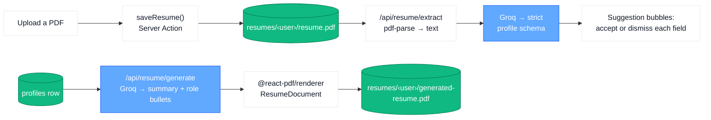

- **Nothing is overwritten silently:** extraction never writes over your profile. Each extracted value shows up next to its field, and you choose whether to accept it.
- **Two separate files:** the generated resume is stored apart from your upload, so generating a new one never replaces your original.

<br />

## Dashboard data

The dashboard reads the database directly. PostHog is only used for event tracking, so the charts and the stat cards can never disagree.

| Widget | Source | Logic (`lib/dashboard.ts`) |
|---|---|---|
| Total jobs found | `jobs` | Count for the user, with week-over-week trend |
| Avg. match rate | `jobs.match_score` | Mean over scored jobs, with week-over-week trend |
| Companies researched | `jobs.company_researched_at` | Count of non-null |
| Jobs this week | `jobs.found_at` | Rolling 7-day window |
| Recent activity | `agent_runs` + researched `jobs` | Merged, newest first, top 5 |
| Jobs found over time | `jobs.found_at` | Per-day buckets, last 7 days (UTC) |
| Company research activity | `jobs.company_researched_at` | Per-day buckets, last 7 days |
| Match score distribution | `jobs.match_score` | `<60 · 60–70 · 70–80 · 80–90 · 90–100` |

The aggregation functions take the date (`now`) as a parameter instead of reading the clock, so they can be tested without any date mocking.

<br />

## Data model

Four tables and one storage bucket. **Every table has row-level security**, with owner-only select, insert, update and delete policies keyed on `auth.uid()`.

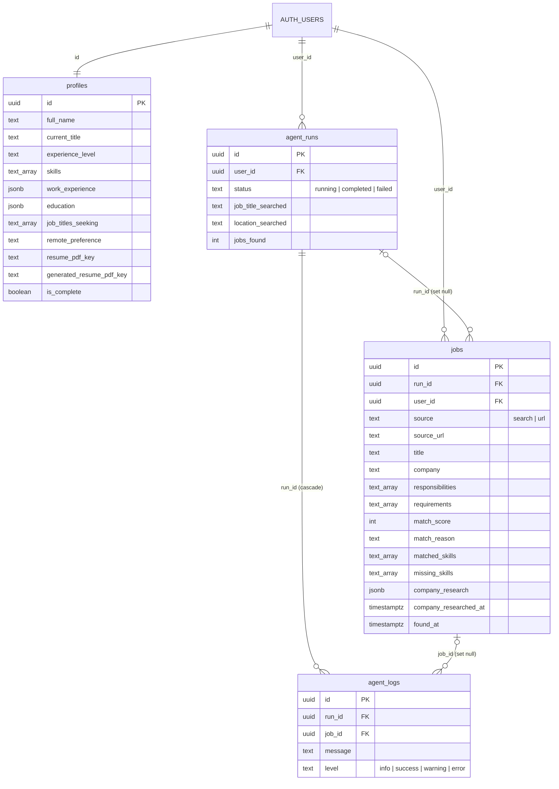

- **Storage:** a private `resumes` bucket, with objects at `{user_id}/resume.pdf` and `{user_id}/generated-resume.pdf`. Storage RLS limits each user to their own folder.
- **Migrations:** kept in [`migrations/`](migrations), timestamped and applied in order with the InsForge CLI.

<br />

## UI and design system

The UI is **token-driven**. Every color, radius, and surface comes from CSS variables in `app/globals.css`, mapped to Tailwind utilities in `tailwind.config.js`. Components never use hex values or Tailwind's built-in palette (`bg-purple-500`).

### Color tokens

| | Token | Value | Used for |
|---|---|---|---|
|  | `accent` | `#7c5cfc` | Primary actions, active nav, focus rings, brand |
|  | `text-primary` | `#101828` | Headings, body text, dark buttons |
|  | `text-secondary` | `#6a7282` | Labels, supporting copy |
|  | `background` | `#f6f7fb` | Page background |
|  | `border` | `#e7eaf3` | Every border and divider |
|  | `success` | `#10b981` | Match ≥ 80, matched skills |
|  | `info` | `#61a8ff` | Match 60–79, research activity |
|  | `warning` | `#ff8904` | Match < 60, partial research |
|  | `error` | `#ef4444` | Errors, missing profile fields |
|  | `overlay` | `#111827` | Dark showcase panels (login, homepage CTA) |

### Visual language

| Element | Rule |
|---|---|
| Font | Inter via `next/font/google` |
| Cards | White, `1px` `border`, `16px` radius, soft two-layer shadow. Color goes *inside* cards, never on them |
| Buttons | `8px` radius (`rounded-md`). Primary is dark `text-primary` in light areas and `accent` on dark panels. Secondary is white with a border |
| Badges | Pill shaped, `12px`, weight 500, a light tint behind a darker text color |
| Match score | 6px bar in three bands, driven by `matchScoreBarClass()` in one place |
| Layout | Top navbar only, 1440px max width, no sidebar |
| Dark panels | `overlay` background, a faint dot grid, blurred `accent` and `info` glows |
| Brand | `components/layout/Logo.tsx`: a transparent "A" mark plus a live text wordmark, so it stays sharp at any size and on any background |

### Screens and their components

| Screen | Route | Built from |
|---|---|---|
| Homepage | `/` | `Navbar`, `Hero` (pastel glow, trust row, framed screenshot with floating cards), `Features`, `Testimonial`, `BottomCTA` (dark panel), `Footer` |
| Sign in | `/login` | Split layout: OAuth form on the left, dark product preview on the right built from the real `MatchScoreBar` and activity-dot styles |
| Dashboard | `/dashboard` | `ProfileBanner`, `StatsBar`, `RecentActivity`, `ChartCard` wrapping three Recharts charts themed from `lib/chartTheme.ts` |
| Find Jobs | `/find-jobs` | `JobSearchControls`, `JobFilterBar`, `JobsTable`, `MatchScoreBar`, `JobsPagination` |
| Job details | `/find-jobs/[id]` | `JobInfo`, `MatchScore`, `JobDescription`, `ResearchButton`, `CompanyResearch`, `JobActions` |
| Profile | `/profile` | `CompletionIndicator`, `ResumeUpload`, `SuggestionBubble`, `ProfileForm` |

- **Navbar:** see-through with a blur. It centers three section links for visitors and switches to Dashboard / Find Jobs / Profile with icons once you're signed in. On phones it shows icons only.
- **Where the rules live:** exact class recipes for every component are in [`context/ui-registry.md`](context/ui-registry.md), and the token spec is in [`context/ui-tokens.md`](context/ui-tokens.md).

> **Tailwind caveat:** tokens are `var(--color-*)` hex strings in Tailwind 3, so opacity modifiers like `bg-accent/10` **compile to nothing**. Use a dedicated light token (`bg-error-light`), a solid color plus `opacity-*`, or `bg-[color:color-mix(...)]`.

<br />

## Tech stack

| Layer | Tool | Role in Applyr |
|---|---|---|
| Framework | **Next.js 16.2** (App Router) · **React 19.2** | Pages, API routes, Server Actions, `proxy.ts` |
| Language | **TypeScript** (strict) | Throughout |
| Styling | **Tailwind CSS 3.4** + CSS-variable tokens | Token-only design system |
| Backend | **InsForge** (`@insforge/sdk`) | Auth (OAuth + PKCE), Postgres + RLS, Storage |
| Job data | **Adzuna API** | Live listings, `category=it-jobs` |
| LLM | **Groq**, `openai/gpt-oss-20b` via the `openai` SDK | Scoring, resume extraction and generation, dossier synthesis. Every call uses a strict `json_schema` |
| Cloud browser | **Browserbase** | One research session per run |
| Browser automation | **Stagehand v4** + **Gemini 3.6 Flash** | Navigating pages and structured extraction |
| Validation | **Zod 4** | Stagehand extraction schemas |
| PDF | **pdf-parse** · **@react-pdf/renderer** | Reading uploaded resumes, rendering generated ones |
| Charts | **Recharts 3.10** | The three dashboard charts |
| Icons | **lucide-react** | All icons |
| Analytics | **PostHog** (`posthog-js`, `posthog-node`) | Product events, proxied through `/ingest` |

<br />

## Project structure

```
applyr/
├── app/
│   ├── layout.tsx                  Root layout: Inter font, PostHog provider, smooth scroll
│   ├── page.tsx                    Homepage
│   ├── (auth)/login/page.tsx       Sign-in page
│   ├── dashboard/page.tsx          Parallel queries → stats, activity, charts
│   ├── find-jobs/page.tsx          Search + filtered, sorted, paginated jobs
│   ├── find-jobs/[id]/page.tsx     Job details + company research
│   ├── profile/page.tsx            Profile form + resume tools
│   └── api/
│       ├── auth/{login,callback,refresh,logout}/   OAuth + session endpoints
│       ├── agent/find/route.ts                   Discovery + scoring run
│       ├── agent/research/route.ts               Company research run
│       └── resume/{extract,generate,generated}/  Resume AI + file URLs
├── agent/                          Agent logic, no React imports
│   ├── adzuna.ts                   Search, country detection, salary formatting
│   ├── matcher.ts                  scoreJob(): strict-schema LLM scoring
│   ├── company-url.ts              Homepage resolution + sub-page selection (no browser)
│   ├── research.ts                 browseCompany() + synthesiseDossier()
│   └── types.ts
├── actions/profile.ts              saveProfile(), saveResume()
├── components/
│   ├── layout/                     Navbar, Footer, Logo
│   ├── homepage/                   Hero, Features, Testimonial, BottomCTA
│   ├── dashboard/  find-jobs/  job-details/  profile/
│   └── providers/PostHogProvider.tsx
├── lib/
│   ├── insforge-client.ts / insforge-server.ts   Browser vs. server clients
│   ├── ai.ts                       Groq client, model, JSON-schema helpers
│   ├── stagehand.ts                Browserbase + Gemini session factory
│   ├── jobs.ts  dashboard.ts  profile.ts        Pure data shaping
│   ├── navigation.ts               Nav link lists shared by Navbar + Footer
│   ├── chartTheme.ts  agent-logs.ts  utils.ts
│   └── pdf/ResumeDocument.tsx      React-PDF resume template
├── migrations/                     Timestamped SQL, applied with the InsForge CLI
├── proxy.ts                        Session refresh + protected-route guard
├── insforge.toml                   Auth redirect URLs and backend config
├── docs/screenshots/               Images used in this README
├── context/                        Architecture, design tokens, build plan, progress
└── bugs.md                         Verified open bugs, by severity
```

<br />

## Getting started

### Prerequisites

- Node.js 20+
- An [InsForge](https://insforge.dev) project
- API keys for [Adzuna](https://developer.adzuna.com/), [Groq](https://console.groq.com/), [Browserbase](https://www.browserbase.com/) and [Google AI Studio](https://aistudio.google.com/) (Gemini). [PostHog](https://posthog.com/) is optional.

> ⚠️ **Fresh clones currently fail to build.** `.gitignore` excludes `public/images/`, but the homepage imports three images from that folder. Until that's fixed ([bugs.md #1a](bugs.md)), add placeholder `jobs-lists.png`, `agnet-log.png` and `user-icon.png` files to `public/images/`.

### 1. Install

```bash
git clone <this-repo>
cd applyr
npm install
```

### 2. Environment

Create `.env.local`. These are all the variables the code reads:

```bash
# InsForge: auth, database, storage
NEXT_PUBLIC_INSFORGE_URL=
NEXT_PUBLIC_INSFORGE_ANON_KEY=

# Job discovery
ADZUNA_APP_ID=
ADZUNA_APP_KEY=

# LLM: scoring, resume extraction and generation, dossier synthesis
GROQ_API_KEY=

# Company research: cloud browser + the model that drives it
BROWSERBASE_API_KEY=
BROWSERBASE_PROJECT_ID=
GOOGLE_API_KEY=

# Analytics (optional)
NEXT_PUBLIC_POSTHOG_KEY=
NEXT_PUBLIC_POSTHOG_HOST=
```

Research degrades gracefully: without `GOOGLE_API_KEY`, `canBrowse()` returns false and dossiers are written from the posting and your profile alone.

### 3. Backend

```bash
npx -y @insforge/cli login
npx -y @insforge/cli link                      # choose your InsForge project
npx -y @insforge/cli db migrations up --all    # tables, RLS, storage policies
npx -y @insforge/cli storage create-bucket resumes --private
npx -y @insforge/cli config apply              # pushes insforge.toml (OAuth redirect URLs)
```

Then enable the **Google** and **GitHub** OAuth providers in your InsForge project's auth settings. `insforge.toml` already allows `http://localhost:3000/api/auth/callback`; add your production callback URL there before deploying.

### 4. Run

```bash
npm run dev        # http://localhost:3000
npm run lint       # ESLint (includes React Compiler rules)
npx tsc --noEmit   # type-check
npm run build      # production build
```

Sign in, fill out your profile (or upload a resume and accept the extracted suggestions), then go to **Find Jobs**.

<br />

## Engineering rules

These are enforced across the codebase, and [`AGENTS.md`](AGENTS.md) makes them binding for AI coding agents working on the repo.

- **API routes hold no UI logic. Components hold no database logic.**
- **`agent/` never imports from `components/` or `actions/`.** Agent code can run and be tested on its own.
- **Server Actions never call agent functions.** Only API routes do.
- **Every Stagehand call is wrapped in `try/catch`,** and the session is always closed in `finally`.
- **Every query is scoped to the current `user_id`,** with RLS as a second layer of protection.
- **Adzuna is always searched with `category=it-jobs`.**
- **The match threshold comes from one place:** `MATCH_THRESHOLD` in `lib/utils.ts`.
- **Every LLM response is constrained** by a strict `json_schema`, not just requested as JSON.
- **Users never see raw error messages.** Details go to logs and PostHog.
- **Easy Apply is never used.** Only the company's own apply URL.
- **Components use design tokens only.** No hex values and no raw Tailwind colors.

<br />

## Analytics events

| Event | Fired from | When |
|---|---|---|
| `hero_cta_clicked` · `bottom_cta_clicked` · `navbar_get_started_clicked` | Client | Homepage calls to action |
| `login_provider_selected` | Client | A Google or GitHub button is clicked |
| `oauth_login_completed` · `oauth_login_failed` | Server | OAuth callback outcome |
| `job_search_started` · `job_found` | Server | Discovery run |
| `company_researched` | Server | Dossier saved |
| `user_signed_out` | Client | Sign out |

The browser client sends events through Next rewrites at `/ingest/*`, which keeps ad blockers from dropping them.

<br />

## Scope

**Built:** OAuth sign-in · profile with resume extraction and generation · Adzuna discovery with AI scoring · filter, sort and pagination · job details · company research agent · dashboard with stats, activity and charts · PostHog events · responsive public pages.

**Deliberately out of scope:** auto-applying or form filling · cover letters · per-job resume tailoring · scheduled or background runs · notifications · multiple resume versions · team accounts · payments · browser extension · mobile app.

<br />

## Project docs

The [`context/`](context) folder is the project's working spec:

| File | Contents |
|---|---|
| [`project-overview.md`](context/project-overview.md) | Product scope, user flows, success criteria |
| [`architecture.md`](context/architecture.md) | Stack, boundaries, data flow, schema, invariants |
| [`ui-tokens.md`](context/ui-tokens.md) · [`ui-rules.md`](context/ui-rules.md) | Design tokens and visual rules |
| [`ui-registry.md`](context/ui-registry.md) | Exact class recipes for every shipped component |
| [`code-standards.md`](context/code-standards.md) · [`library-docs.md`](context/library-docs.md) | Coding conventions and library gotchas |
| [`build-plan.md`](context/build-plan.md) · [`progress-tracker.md`](context/progress-tracker.md) | The 17-feature build plan and its status |

<br />

<div align="center">

Jobs data by <a href="https://www.adzuna.com">Adzuna</a> · Backend by <a href="https://insforge.dev">InsForge</a> · Research browsing by <a href="https://www.browserbase.com">Browserbase</a>

</div>
