<div align="center">

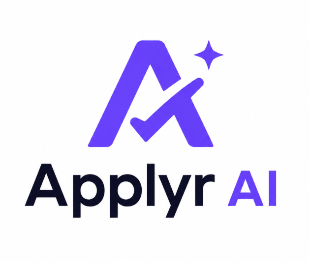

### Job hunting is hard. Your tools shouldn't be.

Applyr is an AI agent that finds jobs, scores them against your real skills, researches every company before you apply, and shows the whole thing on one dashboard.

[](https://nextjs.org)
[](https://react.dev)
[](https://www.typescriptlang.org)
[](https://tailwindcss.com)
[](https://insforge.dev)

</div>

<br />

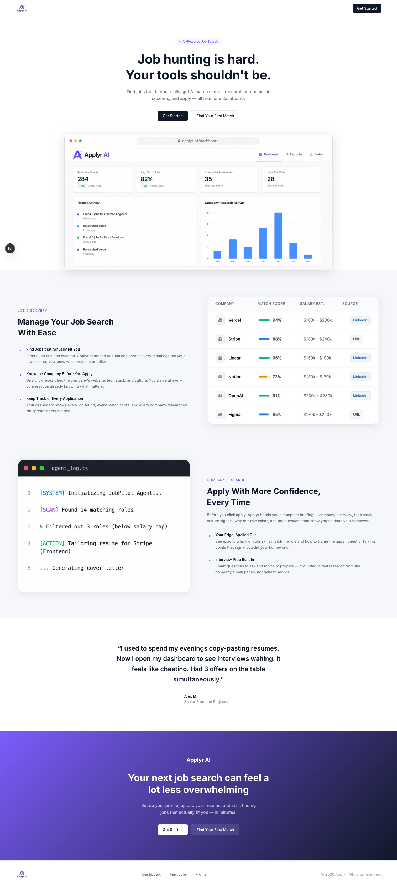

<br />

## What Applyr does

Job hunting means the same three chores on repeat: find postings, figure out which ones are actually worth your time, and dig up enough about each company to sound informed at interview. Applyr runs all three as background agent work instead of manual tabs-open research.

1. **You set up a profile once** — skills, experience, work history, resume.
2. **The agent finds jobs for you.** Give it a title and location; it pulls live listings and scores every single one against your profile, 0–100, with a plain-English reason.
3. **The agent researches the company** the moment you're interested in a role — real pages, real tech stack, real culture signals — and hands you a dossier instead of a blank tab.
4. **You apply with full context**, straight to the company's own application page.

Everything that happens along the way — jobs found, companies researched, match rates — lands on a dashboard that reads the same database the rest of the app writes to, so the numbers on screen are never staged.

<br />

## See it in action

<table>
<tr>
<td width="50%">

**Dashboard** — stats, recent activity, and analytics built on live data

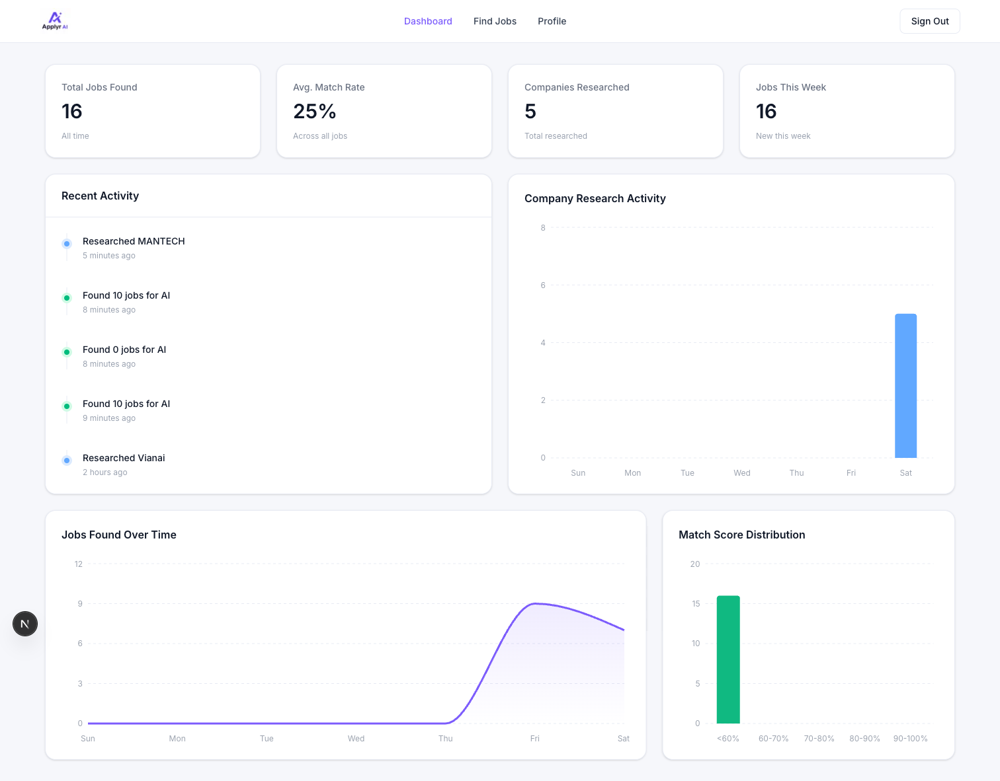

</td>
<td width="50%">

**Find Jobs** — every scored result, filterable and sortable

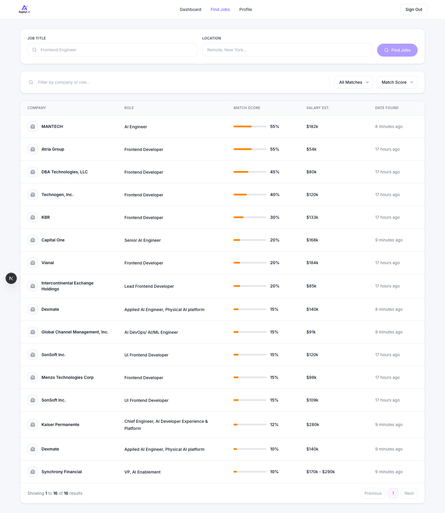

</td>
</tr>
<tr>
<td width="50%">

**Job Details** — match reasoning plus a full company dossier

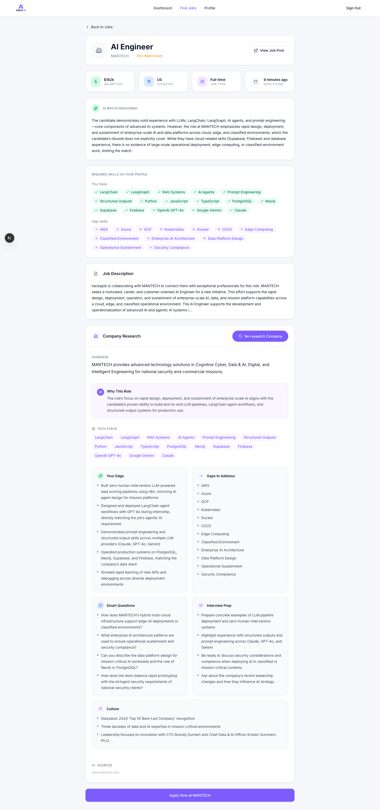

</td>
<td width="50%">

**Profile** — the source of truth the agent scores every job against

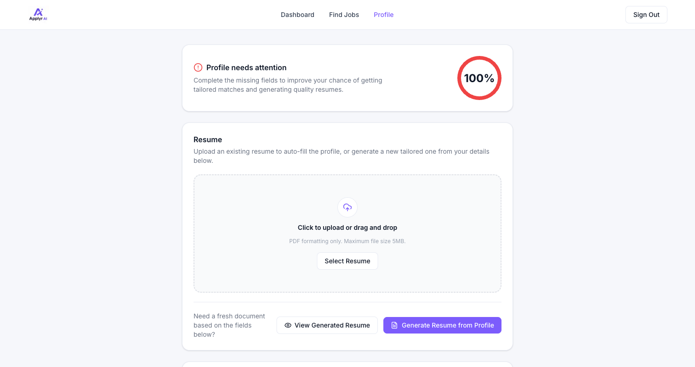

</td>
</tr>
</table>

<details>
<summary><strong>Sign in</strong> — Google / GitHub OAuth via InsForge</summary>
<br />
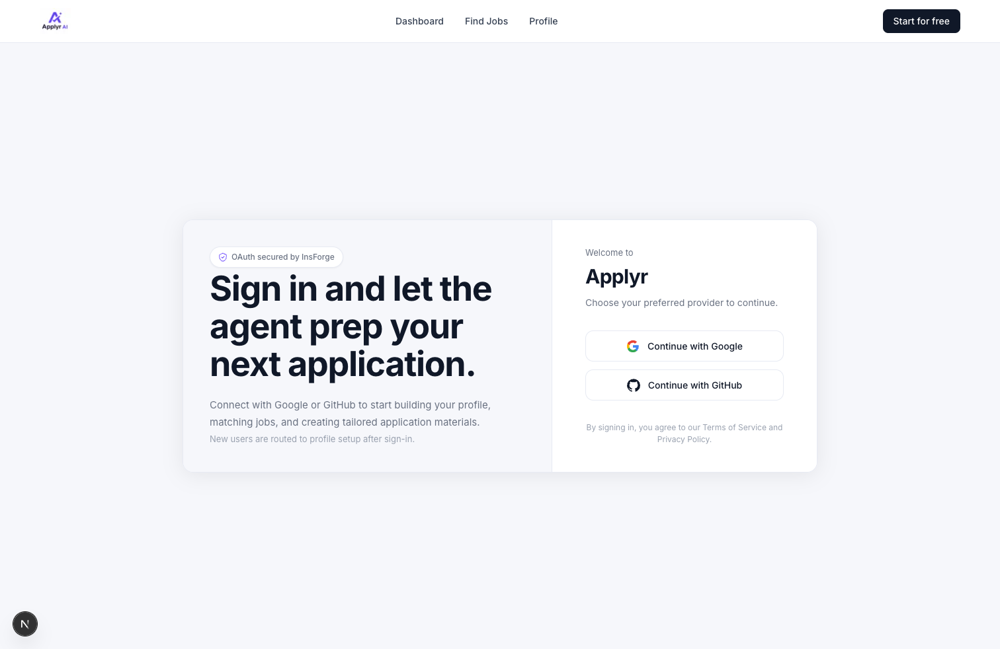
</details>

<br />

## How it works

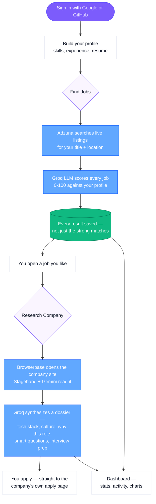

That's the entire product from the outside. The rest of this document is what's running underneath it.

<br />

## Architecture

Applyr is a single Next.js 16 (App Router) application. There's no separate backend service — **InsForge** provides auth, the Postgres database, file storage, and realtime as one hosted platform, and two external AI-driven pipelines (job discovery, company research) run as agent code inside the same app, called only from API routes.

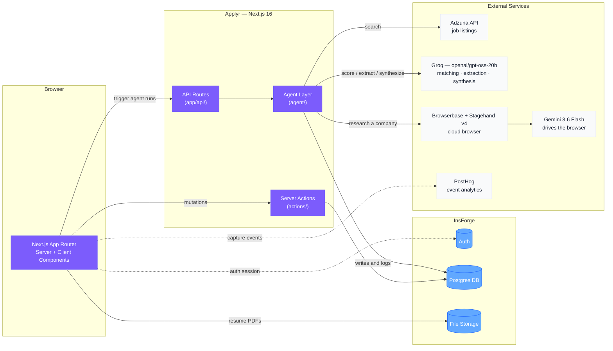

### The rules this system never breaks

These are enforced invariants, not suggestions — they're what keeps agent code, UI code, and data writes from tangling into each other as the app grows:

- **API routes hold no UI logic. Components hold no DB logic.** Each layer does exactly one job.
- **`agent/` never imports from `components/` or `actions/`.** Agent logic has zero React dependency — it can run, or be tested, on its own.
- **Server Actions never call agent functions.** UI-triggered mutations (saving a profile) go through `actions/`; anything agent-driven (searching, researching) goes through an API route instead.
- **Every Stagehand browser action is wrapped in `try/catch`.** A failed page read gets logged and skipped — it never takes down the whole research run.
- **Company research always returns something.** Even when the browser can't reach the company's site, the LLM still synthesizes a dossier from the job posting alone, and the UI says so honestly (an amber "partial" state) rather than pretending the browser succeeded.

<br />

## Under the hood: the two agent pipelines

### Job discovery

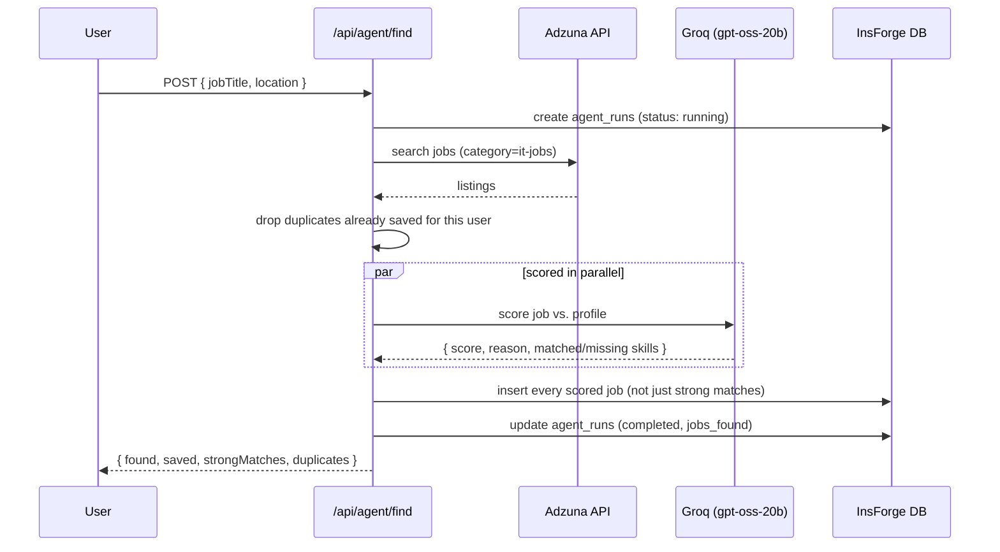

Every scored job is persisted — the low matches too. That's what lets the Find Jobs page filter by "Low Match" later without having thrown the data away at scoring time.

### Company research

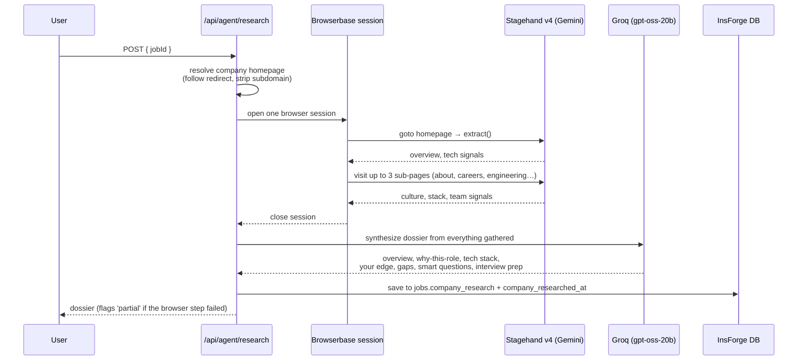

One browser session, visited sequentially, closed before the AI synthesis call ever runs — the expensive part (an open cloud browser) and the reasoning part never overlap.

<br />

## Tech stack

| Layer | Tool | Why |
|---|---|---|
| Framework | **Next.js 16** (App Router) | Full-stack React, server components by default |
| Language | **TypeScript**, strict mode | No `any`, no unchecked promises |
| Styling | **Tailwind CSS 3.4** + shadcn/ui | Design-token driven — no hardcoded colors anywhere |
| Auth · DB · Storage · Realtime | **InsForge** | One Postgres-backed platform instead of four separate services |
| Job discovery | **Adzuna API** | Live job listing search |
| AI reasoning | **Groq** — `openai/gpt-oss-20b` | Matching, resume extraction/generation, research synthesis |
| Cloud browser | **Browserbase** | Runs the company-research browser session |
| Browser control | **Stagehand v4** | Navigates and reads company pages, driven by Gemini |
| Browser-driving model | **Gemini 3.6 Flash** | Groq's free tier can't take Stagehand's ~9k-token page payloads |
| Charts | **Recharts 3.10** | The three dashboard charts, styled from one shared theme file |
| PDF generation | **@react-pdf/renderer** | Renders the AI-tailored resume |
| Analytics | **PostHog** | Event capture — the dashboard's numbers come from the DB, not this |

<br />

## Data model

Four tables, all scoped to `auth.uid()` with row-level security — a user only ever sees their own rows.

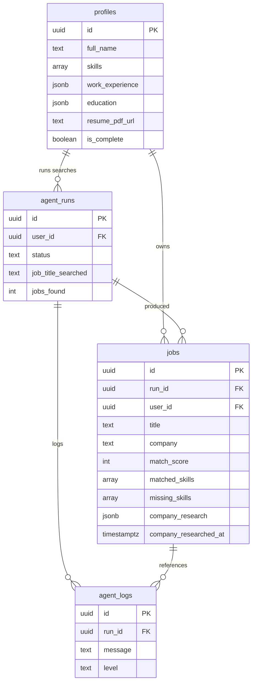

<br />

## Project structure

```
applyr/
├── app/
│   ├── page.tsx                    → Homepage
│   ├── (auth)/login/               → OAuth sign-in
│   ├── dashboard/                  → Stats, activity, charts
│   ├── find-jobs/                  → Search + results + [id] detail page
│   ├── profile/                    → Profile form + resume management
│   └── api/
│       ├── agent/find/             → Triggers Adzuna discovery + scoring
│       ├── agent/research/         → Triggers company research
│       └── resume/                 → Extract from / generate to PDF
├── agent/                          → All agent logic — zero React imports
│   ├── adzuna.ts                   → Job search
│   ├── matcher.ts                  → LLM scoring against a profile
│   ├── research.ts                 → Company research orchestration
│   ├── company-url.ts              → Homepage resolution (no browser)
│   └── extractor.ts                → Job description structuring
├── actions/                        → Server Actions — UI mutations only
├── components/                     → UI only, no DB calls
│   ├── dashboard/  find-jobs/  job-details/  profile/  homepage/  layout/
├── lib/                            → Client init + shared utilities
│   ├── insforge-client.ts / insforge-server.ts
│   ├── stagehand.ts   ai.ts   adzuna.ts   dashboard.ts   chartTheme.ts
├── migrations/                     → SQL migrations, applied via InsForge CLI
└── context/                        → Architecture, design tokens, and build docs
```

<br />

## Getting started

### Prerequisites

- Node.js 20+
- An [InsForge](https://insforge.dev) project (Postgres + Auth + Storage)
- API keys for: [Adzuna](https://developer.adzuna.com/), [Groq](https://console.groq.com/), [Browserbase](https://www.browserbase.com/), [Google AI Studio](https://aistudio.google.com/) (Gemini), and optionally [PostHog](https://posthog.com/)

### Install

```bash
git clone <this-repo>
cd applyr
npm install
```

### Configure environment

Create `.env.local` with:

```bash
# InsForge — auth, database, storage
NEXT_PUBLIC_INSFORGE_URL=
NEXT_PUBLIC_INSFORGE_ANON_KEY=
INSFORGE_API_KEY=

# Job discovery
ADZUNA_APP_ID=
ADZUNA_APP_KEY=

# AI reasoning — matching, extraction, synthesis
GROQ_API_KEY=

# Company research — cloud browser + the model that drives it
BROWSERBASE_API_KEY=
BROWSERBASE_PROJECT_ID=
GOOGLE_API_KEY=

# Analytics (optional — event capture only, not required for the app to run)
NEXT_PUBLIC_POSTHOG_KEY=
NEXT_PUBLIC_POSTHOG_HOST=
```

### Set up the database

Apply the migrations in `migrations/` to your InsForge project via the InsForge CLI, then create a private `resumes` storage bucket (this one step isn't in a migration — see `context/architecture.md`).

```bash
npx @insforge/cli db migrations up --all
```

### Run it

```bash
npm run dev
```

Open [http://localhost:3000](http://localhost:3000), sign in with Google or GitHub, and fill out a profile to get started.

<br />

## Known limitation

Company research works end-to-end — the browser session, Gemini extraction, and dossier synthesis are all verified live — but it currently can't reliably resolve a real company domain to visit: **Adzuna's tracking redirect blocks both server-side `fetch` and Browserbase's datacenter IPs**, so most runs fall back to guessing `https://www.{companyName}.com`, which is wrong for a lot of companies. The UI is honest about this — a run that couldn't browse the real site shows an amber "partial" banner instead of a false success. See `context/progress-tracker.md` for the options being weighed (residential proxies, in-browser search-engine resolution, or an AI-guessed-and-verified domain).

<br />

<div align="center">

Built with Next.js, InsForge, and a genuinely excessive amount of context engineering.

</div>
